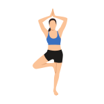

# [YogaVision](https://yogavision.weike.ca)

**Take charge of your well being.**

Connect with your body on another level with YogaVison. The app that helps you perfect your yoga poses. Just choose a pose, try your best to imitate it, and our computer vision algorithm will give you a score to indicate how well you did! Based on your score, just continue iterating your pose and you will become a yoga master in no time!

YogaVision was jointly developed by [Weike Qu](https://github.com/weikequ), [Seungwon Lim](https://github.com/limseung1), [Phillip Tellier](https://github.com/ptellier), [Matthew Ma](https://github.com/mamatthew), and [Orel Ben Neriah](https://github.com/orelbn) for the BCS Hackathon. This project won **first place** in the event.

## **Techincal Specifications**

### Languages, Libraries, and API's

This project was built using React.js, JavaScript, MaterialUI, React Webcam API, and Google's MediaPipe Pose API.

#### Google's MediaPipe Pose

An open-source Machine Learning API allows you to do real-time analysis by detecting different parts of your body. 

#### The math behind the magic

Computer vision returns a list of points in 3d space for each joint in the human body. For each relevant body segment, such as shoulder to elbow or hip to knee, an angle is calculated based on the two points from the segment and another extrapolated point that gives a segment parallel to the ground. Angle data has been collected from our expert yogis about ideal yoga pose posture. For each body segment, the ideal angle is compared to the user's angle to return a score out of 100. The difference in angles is plugged into a quadratic function that gives a score of 100 at a 0-degree difference and 0 at a 180-degree difference. The quadratic function ensures angle difference values like 45 degrees still give a reasonably low score than a simpler linear function.

  
  
